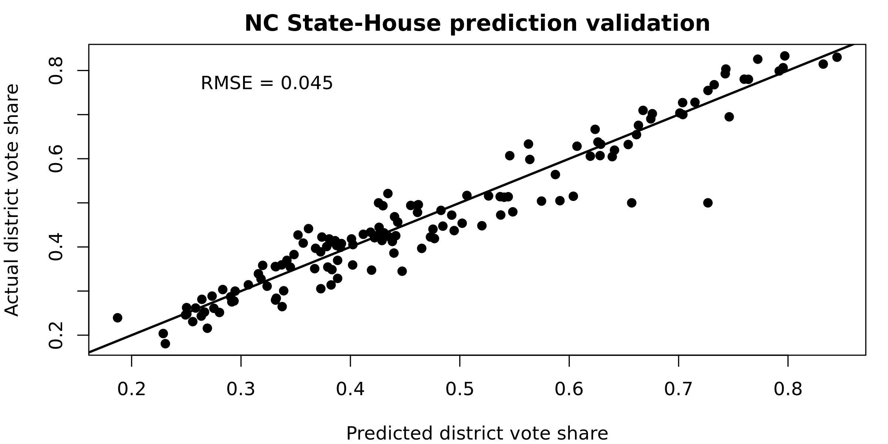
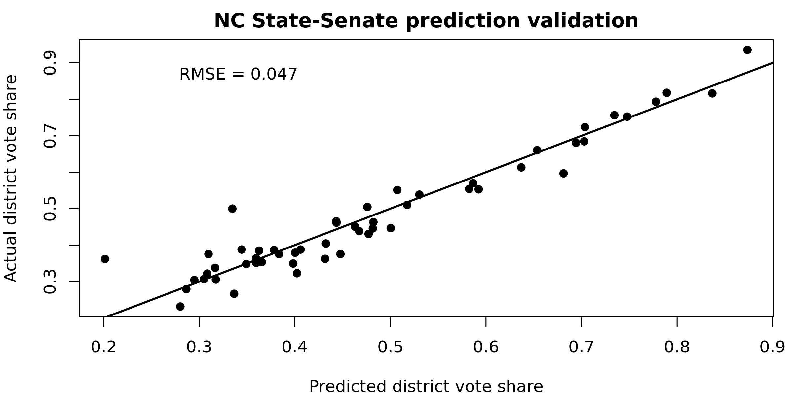

North Carolina Model
===

PlanScore bases its scores on predicted precinct-level votes for each office:
2018 State House and 2018 State Senate. We generate these predicted votes using
demographic and political variables entered into an ordinary least squares
regression model. 

To predict turnout we regress total major-party vote for the race in question
on total major-party 2016 presidential vote. To predict vote share we regress
the Democratic share of the major-party 2018 vote on the Democratic share of
the major-party 2016 presidential vote. Using the coefficients and standard
errors from these models, we then generate 1,000 simulated total votes and
Democratic vote shares for each precinct. These numbers are the inputs for
calculating 1,000 sets of efficiency gaps, partisan biases, and mean-median
differences, which produce the means and margins of error reported on
PlanScore.org.

[Complete model code is available in `PlanScore/Model-Generator`](https://github.com/PlanScore/Model-Generator).

Predicted vs. Actual Vote Share, 2018
---

